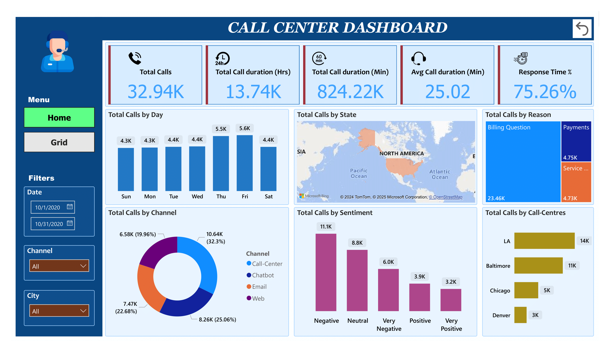

# Call Center Dashboard

## Project Overview
The Call Center Dashboard provides a comprehensive view of call center performance by consolidating key metrics into a single, interactive Power BI dashboard. It helps identify trends, improve customer satisfaction, and optimize call center operations.

## Dashboard Preview
### GIF Demonstration

*Animated walkthrough of the dashboard features.*

## Objective
To create a user-friendly Power BI dashboard that enables real-time monitoring of call center operations, key metrics, and insights to improve decision-making and operational efficiency.

## Key Metrics
- **Total Calls:** 32.94K
- **Total Call Duration:** 13.74K hours (824.22K minutes)
- **Average Call Duration:** 25.02 minutes
- **Response Time Percentage:** 75.26%

## Key Insights
1. **Call Volume Trends:**
   - Highest call volumes on Thursdays and Fridays.
   - Weekends witness a dip in call activity.

2. **Performance by State:**
   - States with the highest number of calls include California and Texas.

3. **Call Sentiment Analysis:**
   - Majority of calls have a neutral or negative sentiment.
   - Positive sentiment calls are below expectations, highlighting improvement areas.

4. **Channel Insights:**
   - Chatbots and emails handle a significant portion of inquiries, reducing call-center dependency.

5. **Call Center Comparison:**
   - Los Angeles handles the highest call volume (14K), followed by Baltimore (11K).

## Project Structure
1. **Data Sources:**
   Data from multiple channels, including Call Centers, Chatbots, Emails, and Web, was collected.

2. **ETL Process:**  
   Data was transformed using Power Query to clean and structure it for analysis.

3. **Dashboard Components:**  
   - Total Calls Overview
   - Metrics by Day, State, Reason, Channel, Sentiment
   - Comparative Analysis of Call Centers  

4. **Interactivity:**
   Filters for Channel, City, and Date provide customizable insights.  

### Dashboard Images
#### Overall Call Metrics

*Visual of total calls, call durations, and response time.*  

#### Sentiment and Channel Insights

*Breakdown of calls by sentiment and communication channel.*

## Outcomes
- **Improved Operational Efficiency:** Enabled decision-makers to focus on underperforming areas.
- **Enhanced Customer Satisfaction:** Insights into sentiment trends allowed for targeted improvements.  
- **Time-Saving Analytics:** Automation of reporting reduced manual effort significantly.  

## Developed By

**Abhimanyu Kumar**
**Date**: 19-01-2025
[LinkedIn Profile](https://www.linkedin.com/in/abhimanyu7870/)

---

Thank you for reviewing the Call Center Dashboard!